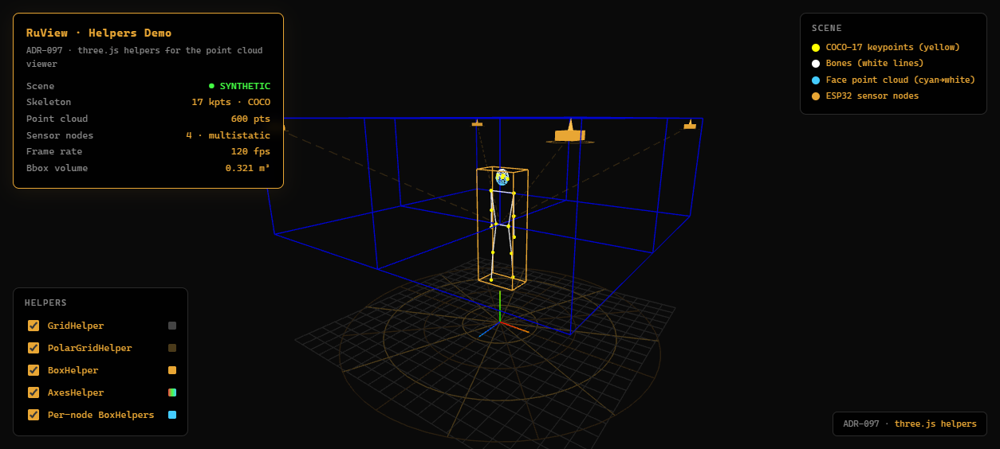
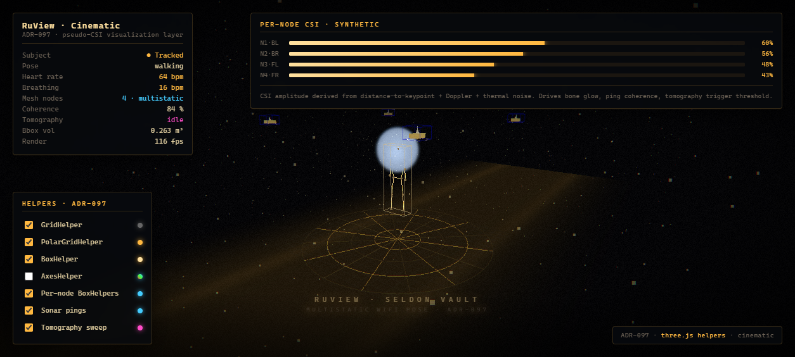
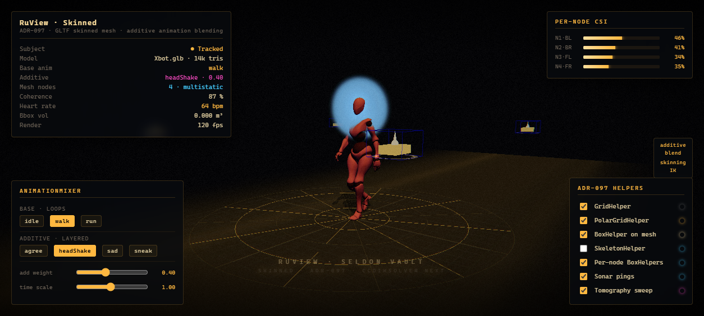
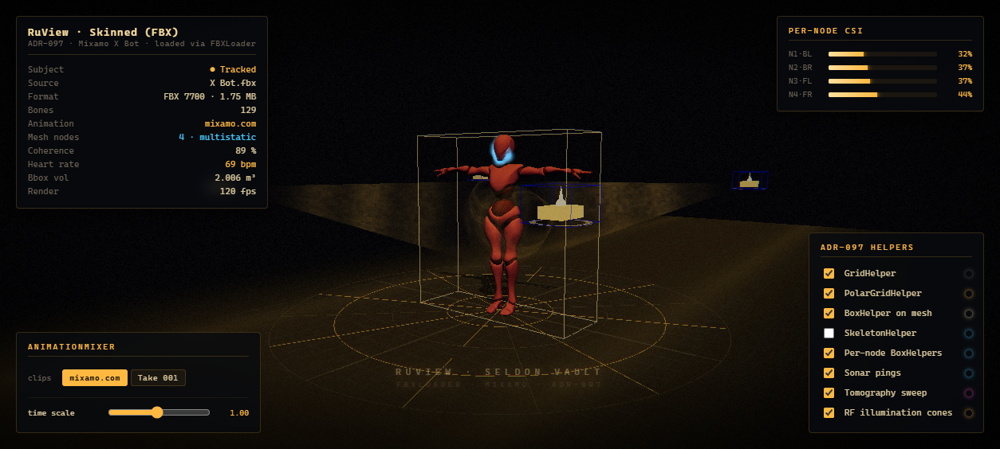
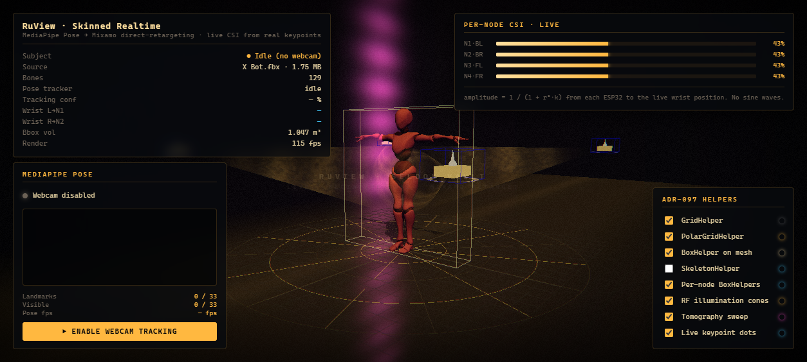

# three.js demos

Five progressively richer browser demos of the ADR-097 sensing-helpers scene,
ending with a live MediaPipe-Pose → Mixamo X Bot retargeting pipeline driven
by a real ESP32 CSI feed.

## Run them

```bash
python examples/three.js/server/serve-demo.py
# then open one of the URLs the script prints
```

`server/serve-demo.py` is a tiny `ThreadingHTTPServer` with aggressive
no-cache headers — the stdlib `http.server` is single-threaded and times out
on the parallel script + FBX fetches the demos make.

## Demos

| # | File | What it shows |
|---|------|---------------|
| 01 | [`demos/01-helpers.html`](demos/01-helpers.html) | Plain ADR-097 helpers in the point-cloud viewer |
| 02 | [`demos/02-cinematic.html`](demos/02-cinematic.html) | Cinematic camera + pseudo-CSI visualization on top of #01 |
| 03 | [`demos/03-skinned.html`](demos/03-skinned.html) | GLTF skinned mesh + additive animation blending |
| 04 | [`demos/04-skinned-fbx.html`](demos/04-skinned-fbx.html) | Mixamo X Bot loaded from FBX in the ADR-097 scene |
| 05 | [`demos/05-skinned-realtime.html`](demos/05-skinned-realtime.html) | Webcam → MediaPipe Pose Heavy → Mixamo IK retarget, live ESP32 CSI overlay |

| Screenshot | |
|---|---|
|  |  |
|  |  |
|  | |

## Layout

```
examples/three.js/
├── README.md
├── .gitignore
├── demos/                       # 5 self-contained HTML demos
│   ├── 01-helpers.html
│   ├── 02-cinematic.html
│   ├── 03-skinned.html
│   ├── 04-skinned-fbx.html
│   └── 05-skinned-realtime.html
├── screenshots/                 # one PNG per demo
│   └── 0N-*.png
├── server/
│   ├── serve-demo.py            # local HTTP server with no-cache headers
│   └── ruvultra-csi-bridge.py   # ESP32 CSI WebSocket bridge (ruvultra:8766)
└── assets/
    └── X Bot.fbx                # gitignored — get your own from mixamo.com
                                 #   (FBX Binary, T-Pose, Without Skin)
                                 # used by demos 04 and 05
```

## Mixamo X Bot

Demos 04 and 05 expect `assets/X Bot.fbx`. It's gitignored (size + license
boundary). Download yours from [mixamo.com](https://mixamo.com): pick the
"X Bot" character, export as **FBX Binary**, **T-Pose**, **Without Skin**,
and drop it into `assets/`.

## Live ESP32 CSI overlay (demo 05 only)

`server/ruvultra-csi-bridge.py` is the systemd-deployable bridge that runs on
the `ruvultra` host (over Tailscale). It listens for ESP32-S3 CSI on UDP and
re-broadcasts it as WebSocket frames at `ws://ruvultra:8766/csi`. Demo 05
auto-connects; if the socket is down, it falls back to the bundled idle clip
plus a synthetic CSI driver.

## Open issues

- [#583](https://github.com/ruvnet/RuView/issues/583) — head/face tracking
  fidelity in `05-skinned-realtime.html`. Recommended fix: swap MediaPipe
  Pose Heavy for MediaPipe Holistic (same API, adds 468-point face mesh +
  hand landmarks for proper PnP head pose and finger curl tracking).
